<!--
Dan Marques — GitHub Profile README
Theme: Black / Gold / Galactic / Epic
Tone: Senior • Product Engineer • Builder of Long-Lived Systems
-->

  

  

  
  
  
  

  
  
  

---

## 🧠 About Me

I’m a **product-driven full-stack engineer** focused on building **production-grade systems** — not demos, not experiments, not disposable code.

My work spans **SaaS platforms**, **business systems**, and **data-driven simulation engines**, guided by:

- **clarity over cleverness**
- **structure over chaos**
- **longevity over hype**

I design software the way infrastructure is designed:  
to **carry weight**, **survive scale**, and **evolve without collapsing**.

---

## 🛠️ What I Build

🟡 **SaaS Platforms**  
Authentication • Roles • Dashboards • Secure business logic

🟡 **Business & Service Websites**  
SEO-first • Performance-focused • Conversion-aware

🟡 **Internal Systems & Tools**  
Admin panels • Data workflows • Automation

🟡 **Simulation & Game Engines**  
Rulesets • Seasons • Deterministic logic • Data-driven systems (Unity / C#)

---

## 🧩 Tech Stack

### 🌐 Frontend

  

### ⚙️ Backend

  

### 🧠 Systems & Tools

  

---

## 📌 Featured Projects

🚀 **RB Personal Trainer — SaaS Platform**  
Multi-role platform with authentication, dashboards, goal tracking, and secure sessions  
**Stack:** PHP • MySQL • JavaScript

🏁 **Open-Wheel Racing Manager — Simulation Engine**  
Simulation-first racing manager with seasons, drivers, teams, and regulation systems  
**Stack:** C# • Unity

🏢 **Zach’s Quality Services — Business Website**  
Production website for a real company, focused on SEO, performance, and conversions  
**Stack:** HTML • CSS • JavaScript

➡️ Explore the pinned repositories below.

---

## 🗺️ Roadmap

- 🔹 Harden SaaS architecture and documentation
- 🔹 Expand automated testing and CI pipelines
- 🔹 Expose APIs for mobile and external integrations
- 🔹 Advance simulation engines with AI-driven systems
- 🔹 Evolve projects into fully polished products

---

## 🏆 GitHub Achievements 

 
 

 

--- 

## 📊 GitHub Activity  

 
 

 

 
 

---

## 🤝 Let’s Connect

- 📧 Email: marquesdangelo@hotmail.com  
- 💼 LinkedIn: https://www.linkedin.com/in/dângelo-marques-576144395/  
- 🧠 Dev.to: https://dev.to/danmarques127sys  
- 📸 Instagram: https://www.instagram.com/dangelomarques_26/

---

  <i>“Good software is not rushed. It is designed, tested, and allowed to live.”</i>

  

